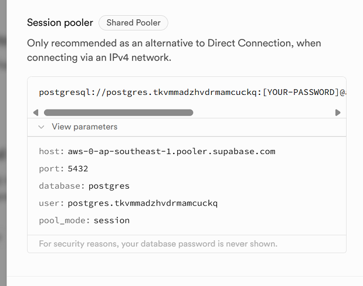
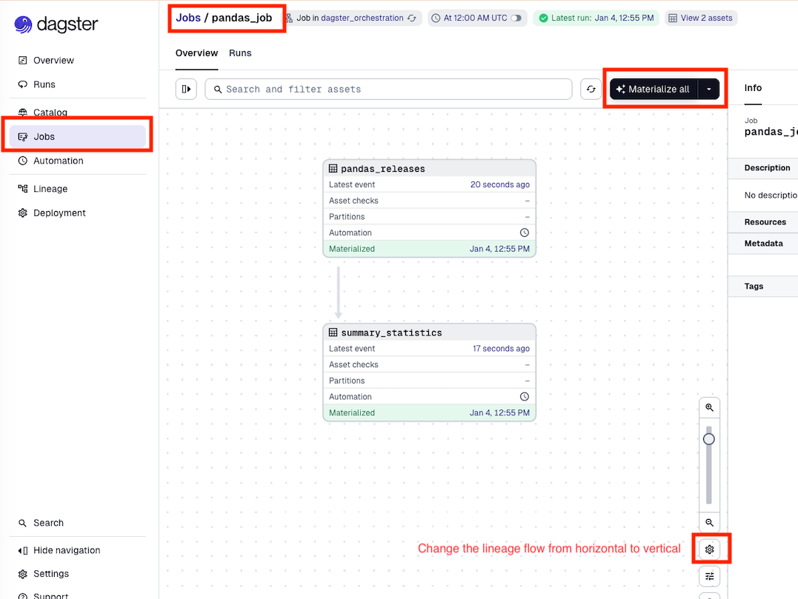
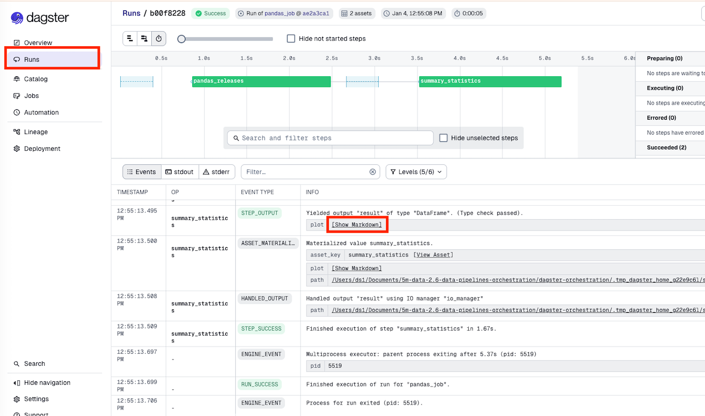

# Lesson

## Brief

### Preparation

Create the conda environment based on the `elt-environment.yml` file in the [environment folder](https://github.com/su-ntu-ctp/5m-data-2.1-intro-big-data-eng/tree/main/environments). We will also be using google cloud (for which the account was created in the previous unit) in this lesson.

### Lesson Overview

Due to the rise of cloud data warehouse, data pipelines and ingestion model has shifted from Extract, Transform and Load (ETL) to Extract, Load and Transform (ELT), as alluded to in the previous unit. We learnt about the _Transform_ part in unit 2.5, as well as the _Extract_ (data extraction and web scraping) in unit 2.4.

In this lesson, we will instead use a framework (and platform) called `Meltano` which handles the end-to-end data pipeline, from **ingestion** (_Extract_ and _Load_), to _Transform_ via `Dbt` once the data is loaded into the data warehouse.

We will also learn about an orchestration framework called `Dagster`. Data orchestration is the process of automating the data pipeline, including scheduling, monitoring, and alerting. `Dagster` is an open-source data orchestration framework for data engineering, data science, and machine learning pipelines.

### Learning Objectives

By the end of this lesson, you will be able to:

1. Explain the difference between ETL and ELT, and why ELT is preferred in modern cloud data stacks
2. Use Meltano to extract data from an API source (GitHub) and load it into BigQuery
3. Use Meltano to extract data from a relational database (Postgres/Supabase) and load it into BigQuery
4. Use dbt to transform raw ingested data in BigQuery into analytical models
5. Build a simple Dagster pipeline that schedules and orchestrates data assets

### How This Lesson Is Structured

This lesson has three parts, each building on the previous:

| Part | What You Build | Tools |
|------|----------------|-------|
| Part 1 | Ingest GitHub data → BigQuery | Meltano, tap-github, target-bigquery |
| Part 2 | Ingest Postgres (HDB resale) data → BigQuery, then transform it | Meltano, tap-postgres, target-bigquery, dbt |
| Part 3 _(Optional)_ | Orchestrate and schedule the pipeline | Dagster |

You can think of the full picture as:

```
Data Sources          Ingestion (EL)       Warehouse        Transform (T)     Orchestration
─────────────         ──────────────       ─────────        ─────────────     ─────────────
GitHub API      ───►  Meltano            ►  BigQuery  ───►  dbt models   ───►  Dagster
Postgres/Supabase ──► (tap → target)
```

---

## Initial Set up

Ensure you have conda setup as mentioned in the preparation section.

You should have `elt` conda environment ready. You can activate it via:

```
conda activate elt
```


Also - please ensure you have a Google cloud setup for GCP as well as installed the gcloud CLI:

https://cloud.google.com/sdk/docs/install 

---

## Part 1 - Hands-on with ELT

### Background

In the late 2010s, numerous companies and open-source initiatives emerged to address the challenge of ELT in the burgeoning world of SaaS. They sought to streamline the process of assimilating data from multiple SaaS platforms into a unified warehouse for analysis, mainly for Business Analytics purposes.

A standout open-source solution for ELT was `Singer`. Its core idea was straightforward: you could create any data extraction program, such as a basic Python script using requests, to retrieve data from a source. Similarly, you could design any data loading program to deposit this data into destinations like MySQL, Redshift, Snowflake, Databricks, Azure Synapse, Duck DB, and others. As long as your extraction tool (termed a 'tap') and your loading tool (labeled a 'target') were compliant with the serialized JSON format set by Singer, you could effortlessly transfer the data from the tap to the target using a single command.

Beyond this, the Singer.io framework offered additional functionalities, including the ability to set up a catalog.py to choose the data for replication, a STATE JSON blueprint for retaining details across tap usages, and a configuration file containing essential details like credentials to extract data from the source.

With this standard in place, any data enthusiast could contribute a tap or target to the shared open-source repository.

In 2018, the project was rebranded as `Meltano`. Building on the original Singer specification, Meltano added an SDK for building new integrations, a configuration wrapper, and an integrations Hub to support the community of Singer users. At the time of writing, the Meltano Hub offers over 550 integrations.


### Why Meltano Instead of Writing Our Own Scripts?

In unit 2.4, we wrote Python scripts to call the GitHub API and extract data manually. That works for a one-off task, but in production data engineering, you need pipelines that:

- Run on a schedule reliably
- Handle authentication, retries, and errors automatically
- Can be extended to dozens of sources without rewriting everything from scratch
- Produce logs and state so you know what was extracted and when

Meltano solves all of this. The same GitHub data we pulled manually in unit 2.4 can be extracted, loaded into BigQuery, and scheduled — all with configuration rather than custom code.

### What You Will Do in Part 1 (Steps Overview)

1. Create a Meltano project (`meltano-ingestion`)
2. Add and configure `tap-github` to extract pandas release data from the GitHub API
3. Test with a local JSON dump to verify the data looks correct
4. Add and configure `target-bigquery` to load data into your BigQuery data warehouse
5. Run the full EL pipeline

### Create a Meltano Project

We will create a Meltano project and use it to

1. extract data from Github and load it into a BigQuery dataset.
2. extract data from a Postgres database and load it into a BigQuery dataset.

We will treat the BigQuery dataset as our data warehouse. The 2 tasks above are typical data ingestion pipelines, which extract data from external and internal sources and load them into a data warehouse.

To create a Meltano project, run:

```bash
meltano init meltano-ingestion
```

```bash
cd meltano-ingestion
```

Set Python 3.11 for all plugins to be inline with environment.

```bash
meltano config set meltano python python3.11
```

> **Why set the Python version?** Meltano installs each tap and target into its own virtual environment. Setting the Python version here ensures all plugins use the same Python version as your conda environment, avoiding version mismatch errors.

### Add an Extractor to Pull Data from Github

> **What is an extractor (tap)?** In Meltano's terminology, a _tap_ is a plugin that reads data from a source — an API, a database, a file, etc. — and outputs it in a standardised format. Meltano's Hub provides pre-built taps for hundreds of sources, so you don't have to write API clients from scratch.

We're going to add an extractor for GitHub to get our data.
We will use the `tap-github` extractor to pull the _releases_ of `pandas` library from Github. This will be a replication of what we did in unit 2.4.

To add the extractor to our project, run (make sure you are in the `meltano-ingestion` folder!):

```bash
meltano add tap-github
```

Next, configure the extractor by running:

```bash
meltano config set tap-github --interactive
```

You will be prompted to enter many options, we just need to enter the following:

- `auth_token`: Please use the same auth token (ie. personal access token) you created for your own Github repo during earlier lesson. **Please note that when you paste the token, it will not display on the screen.**
- `repositories`: `["pandas-dev/pandas"]`

> **Where does this configuration go?** Meltano saves non-sensitive settings to `meltano.yml` and secret values (like tokens) to a `.env` file. This separation is deliberate — `meltano.yml` can be committed to git, while `.env` should never be committed.

This will add the configuration to the `meltano.yml` file, and the secret auth token to the `.env` file. Note that if you want to set them programmatically, you can refer to: https://hub.meltano.com/extractors/tap-github/ 

Next, we need to test the connection using the command below:
```bash
meltano config test tap-github
```
> Note:
> - To check if your token is correct, under the folder `meltano-ingestion`, look for `.env` file and make sure your token is correct.
> - Also make sure your token has not expired.
> - Under the folder `meltano-ingestion`, look for the file `meltano.yml`. Make sure your `repositories`is `["pandas-dev/pandas"]`.


Now that the extractor has been configured, it'll know where and how to find your data, but won't yet know which specific entities and attributes (tables and columns) you're interested in.

By default, Meltano will instruct extractors to extract all supported entities and attributes, but we're going to select specific ones for this tutorial. Find out what entities and attributes are available:

```bash
meltano select tap-github --list --all
```

> **Why select specific attributes?** Extracting everything is wasteful — it increases data transfer time, storage costs, and noise in your warehouse. In production, you always want to be intentional about what you extract. Think of it like a `SELECT` clause in SQL: only pull the columns you actually need.

If you recall from unit 2.4, we are interested in the `releases` entity, with the following attributes:

- `tag_name`
- `body`
- `published_at`

To select the entities and attributes, run:
see: https://docs.meltano.com/guide/integration#selecting-entities-and-attributes-for-extraction 

```bash
meltano select tap-github releases tag_name
meltano select tap-github releases body
meltano select tap-github releases published_at
```

We can use the following command to confirm what we have selected:
```bash
meltano select tap-github --list
```

### Add a Dummy Loader to Dump Data into JSON

> **Why test with JSON first?** Before sending data to BigQuery, it's good practice to do a quick local test to confirm the extractor is working and the data looks correct. The `target-jsonl` loader writes each record as a line of JSON to a local file — it's the fastest way to see what your tap is producing without needing any cloud setup.

We add a JSON target to test our pipeline. The JSON target will dump the data into a JSON file.

```bash
meltano add target-jsonl
```

### Test Run Github to JSON

We can now test run the pipeline to see if it works.

```bash
meltano run tap-github target-jsonl
```

The extracted data will be dumped into a JSON file in the `output/` directory.

> Open the output file and verify that you can see the `tag_name`, `body`, and `published_at` fields for each release. If the file is empty or missing, revisit your `auth_token` and `repositories` configuration.

You can find the above tutorial here: https://docs.meltano.com/getting-started/part1/#select-entities-and-attributes-to-extract

### Add a Loader to Load Data into BigQuery

> **What is a loader (target)?** A _target_ is the counterpart to a tap — it receives the standardised data stream from the tap and writes it to a destination. `target-bigquery` writes data directly into a BigQuery dataset, handling table creation, schema inference, and batching automatically.

In your existing GCP project, go to BigQuery. Then create a dataset in BigQuery called `ingestion` (multi-region: US).

Finally, create a service account with the `BigQuery Admin` role and download the JSON key file to your local machine.

> **Why a service account?** A service account is a non-human identity used by applications (like Meltano) to authenticate to Google Cloud. It allows Meltano to write to BigQuery without requiring your personal Google login credentials, which is the correct practice for automated pipelines.

We will now add a loader to load the data into BigQuery.

```bash
meltano add target-bigquery
```

```bash
meltano config set target-bigquery --interactive
```

Set the following options:

- `credentials_path`: _full path to the service account key file_
- `dataset`: `ingestion`
- `denormalized`: `true`
- `flattening_enabled`: `true`
- `flattening_max_depth`: `1`
- `method`: `batch_job`
- `project`: *your_gcp_project_id*

> **What do `flattening_enabled` and `denormalized` do?** APIs often return nested JSON (objects inside objects). `flattening_enabled: true` tells the loader to automatically flatten nested fields into separate columns, making the data easier to query with SQL. `denormalized: true` ensures that nested repeated fields are expanded into individual rows rather than stored as JSON strings.


### Temporary Work Around for Meltano Packaging Issue
On February 6, 2026, `setuptools` released version 81.0.0, which officially removed the module `pkg_resources` entirely which meltano depends on. The work around fix is as follows:
1. Open `meltano.yml` under the project folder `meltano-ingestion`.
2. Under `name: target-bigquery`, look for `pip_url: git+https://github.com/z3z1ma/target-bigquery.git`
3. Add `setuptools<80` with a space after git. The resulting setup as as follows:


### Run Github to BigQuery

We can now run the full ingestion (extract-load) pipeline.

```bash
meltano run tap-github target-bigquery
```

You will see the logs printed out in your console. Once the pipeline is completed, you can check the data in BigQuery.

> **What to verify in BigQuery:** Navigate to your `ingestion` dataset. You should see a new table called `releases`. Click on it and use the Preview tab to confirm that your data has been loaded correctly with the columns `tag_name`, `body`, and `published_at`.

---

## Part 2 - ELT from Postgres to Bigquery using HDB Resales Data with dbt

### Why Part 2 Is Different from Part 1

In Part 1, we extracted data from an **external API** (GitHub). In Part 2, we extract from an **internal relational database** (Postgres on Supabase) — a more common scenario in enterprise data engineering, where operational databases hold transactional data that needs to flow into the data warehouse for analysis.

We also go further this time: after loading the raw data into BigQuery, we use **dbt** to transform it into cleaned, analytics-ready models. This completes the full ELT cycle:

```
Postgres (Supabase)  ──►  BigQuery (raw)  ──►  dbt models (transformed)
      Extract + Load                               Transform
```

### What You Will Do in Part 2 (Steps Overview)

1. Create a second Meltano project (`meltano-resale`) — separate from the first, because each data source gets its own project
2. Add and configure `tap-postgres` to connect to the HDB resale database on Supabase
3. Select the specific table to replicate
4. Add and configure `target-bigquery` to load data into a `resale` dataset in BigQuery
5. Run the EL pipeline
6. Create a dbt project (`resale_flat`) to transform the raw data
7. Write dbt source and model files
8. Run dbt to build the transformed tables in BigQuery

### Create HDB Resale Data in Postgres-Supabase (Optional)

> Supabase is an open-source backend-as-a-service platform that provides a suite of tools for building applications powered by PostgreSQL (Postgres) as its database. Postgres is a powerful, object-relational database system known for its reliability, extensibility and compliance with SQL standards. Supabase simplifies database management by offering an intuitive interface to interact with Postgres, making it a popular choice for developers looking for a scalable and flexible backend solution.

Go to the [Supabase](https://supabase.com) and create an account. Download the HDB housing data `Resale*.csv` file from the `data/` folder. Follow the instructions in this [setup file](supabase_db_setup_hdb.md) to setup your Postgres database table with the HDB housing data of resale flat prices based on registration date from Jan-2017 onwards. It is the same data that we used in module 1.

> You can skip the database creation if you do not have the time, we will provide a similar database during class.   

### Add an Extractor to Pull Data from Postgres (Supabase)

We will use the `tap-postgres` extractor to pull data from a Postgres database hosted on [Supabase](https://supabase.com). 

From Supabase, take note of your connection details from the Connection window, under Session Spooler:



> The above is just a sample, we will provide actual connection details during class. For those setting up their Postgres database please refer to similar connection details in your database in Supabase.


Please exit `meltano-ingestion` folder, use `cd ..` to return to the root folder. Create a new Meltano project by running:

```bash
meltano init meltano-resale
```

>⚠️ Warning! Many learners here make the mistake here of running `meltano init meltano-resale` inside the `meltano-ingestion` project. Please do not do this! Each meltano project should be within its own project folder. So please return to the root folder `5M-DATA-2.6-DATA-PIPELINES-ORCHESTRATION` before running `meltano init meltano-resale`.

```bash
cd meltano-resale
```

Set the Python version before adding plugins:
```bash
meltano config set meltano python python3.11
```

We're going to add an extractor for Postgres to get our data. An extractor is responsible for pulling data out of any data source. We will use the `tap-postgres` extractor to pull data from the Supabase server. 

To add the extractor to our project, run:

```bash
meltano add tap-postgres
```

Next, configure the extractor by running:

```bash
meltano config set tap-postgres --interactive
```

Configure the following options:

- `database`: `postgres`
- `filter_schemas`: `['public']`
- `host`: `aws-0-ap-southeast-1.pooler.supabase.com` *(example)*
- `password`: *database password*
- `port`: `5432`
- `user`: *postgres.username*

> **What is `filter_schemas`?** A Postgres database can contain many schemas (namespaces for tables). Setting `filter_schemas: ['public']` tells the tap to only look at tables in the `public` schema, which is where the HDB resale table lives. Without this, the tap might try to introspect system schemas and produce errors or extract unnecessary tables.

Test your configuration:
```bash
meltano config test tap-postgres
```

Use the following command to list what is available on the database, it will list all tables in Postgres:
```bash
meltano select tap-postgres --list --all
```

Next, we need to select the table that we need:
```bash
meltano select tap-postgres "public-resale_flat_prices_from_jan_2017" "*"
```

> **Why the `"*"` at the end?** The first argument (`"public-resale_flat_prices_from_jan_2017"`) selects the stream (table), and the second (`"*"`) selects all columns within it. Both arguments are required — selecting the stream alone does not select any columns, so nothing would be extracted.

Use the following command to list and confirm our selection:
```bash
meltano select tap-postgres --list
```

### Add a Loader to Load Data into BigQuery

We will now add a loader to load the data into BigQuery.

```bash
meltano add target-bigquery
```

```bash
meltano config set target-bigquery --interactive
```

Set the following options:

- `batch_size`: `104857600`
- `credentials_path`: _full path to the service account key file_
- `dataset`: `resale`
- `denormalized`: `true`
- `flattening_enabled`: `true`
- `flattening_max_depth`: `1`
- `method`: `batch_job`
- `project`: *your_gcp_project_id*

> **Why `batch_size: 104857600`?** This sets the maximum batch size to 100MB. The HDB resale dataset is large (~180,000+ rows). A larger batch size means fewer round-trips to BigQuery, which makes the load faster and more efficient.

### Temporary Work Around for Meltano Packaging Issue
On February 6, 2026, `setuptools` released version 81.0.0, which officially removed the module `pkg_resources` entirely which meltano depends on. The work around fix is as follows:
1. Open `meltano.yml` under the project folder `meltano-resale`.
2. Under `name: target-bigquery`, look for `pip_url: git+https://github.com/z3z1ma/target-bigquery.git`
3. Add `setuptools<80` with a space after git. The resulting setup as as follows:


You can refer to an example of the `meltano.yml` in the `solutions` branch of the lesson 2.6 repo [here](https://github.com/su-ntu-ctp/5m-data-2.6-data-pipelines-orchestration/blob/solutions/solutions/meltano-ingestion/meltano.yml).

### Run Supabase (Postgres) to BigQuery

We can now run the full ingestion (extract-load) pipeline from Supabase to BigQuery.

```bash
meltano run tap-postgres target-bigquery
```

You will see the logs printed out in your console. Once the pipeline is completed, you can check the data in BigQuery.

> **What to verify in BigQuery:** Navigate to your `resale` dataset. You should see a table called `public_resale_flat_prices_from_jan_2017`. Preview the data to confirm it looks correct. Note that all numeric-looking columns (e.g. `floor_area_sqm`, `resale_price`) are stored as `STRING` — this is expected from the Postgres source. We will fix this in the dbt transformation step.

---

### Create Dbt project

> **Why dbt after Meltano?** Meltano's job is to get the data into the warehouse as faithfully as possible — it does not clean or transform it. The raw table from Meltano reflects exactly what was in Postgres, including string-typed numeric columns. dbt is where we apply business logic: casting types, calculating derived columns, and building aggregated models that are ready for analysis or dashboards.

Let's create a dbt project to transform the data in BigQuery. Before that please exit the `meltano-resale` folder by using the command `cd ..`.

>⚠️ Warning! Please do not create a dbt project inside `meltano-resale` folder. So please return to the root folder `5M-DATA-2.6-DATA-PIPELINES-ORCHESTRATION` before running `dbt init resale_flat`.

To create a new dbt project:

```bash
dbt init resale_flat
```

Fill in the required config details. 
- use service account
- add your path of the json key file
- dataset: resale
- project: your GCP project ID

Please note that the profiles is located at the hidden folder `.dbt` of your home folder. The `profiles.yml` that is located in the home folder includes multiple projects. For best practice, please create a separate `profiles.yml` for each project.

> **Why a project-level `profiles.yml`?** The default `~/.dbt/profiles.yml` is a global file shared across all dbt projects on your machine. Keeping a `profiles.yml` inside each project folder means the project is self-contained and portable — anyone who clones the repo only needs to update the key file path and project ID, without touching a global config file.

To create separate profiles for each project, create a new file called `profiles.yml` under `resale_flat` folder. Then copy the following to `profiles.yml`. Remember to change your key file location and your project ID.
```yaml
resale_flat:
  outputs:
    dev:
      dataset: resale
      job_execution_timeout_seconds: 300
      job_retries: 1
      keyfile: /Users/zanelim/Downloads/personal/secret/meltano-learn-03934027c1d8.json # Use your path of key file
      location: US
      method: service-account
      priority: interactive
      project: meltano-learn # enter your google project id
      threads: 1
      type: bigquery
  target: dev
```


### Create source and models

> **What is a dbt source?** A source tells dbt where the raw data lives — which dataset and table in BigQuery. By declaring it in a `source.yml` file, dbt can reference it by name in your SQL models (using `{{ source(...) }}`), and can also run freshness checks to alert you if the source data has stopped updating.

> **What is a dbt model?** A model is a SQL `SELECT` statement saved as a `.sql` file. dbt compiles it into a `CREATE TABLE` or `CREATE VIEW` statement and runs it in BigQuery. The materialization type (`table` or `view`) is set in the model config. Models can depend on other models, forming a DAG (directed acyclic graph) that dbt executes in the correct order.

> **The two models we will build:**
> - `prices.sql` — cleans the raw table: casts numeric columns from STRING to NUMERIC and adds a calculated `price_per_sqm` column
> - `prices_by_town_type_model.sql` — aggregates the cleaned data by town, flat type and flat model to produce average prices per segment, useful for dashboards and analysis

Create the following files inside the `resale_flat/models/` folder:

> 1. Create a `source.yml` which points to the `resale` schema and `public_resale_flat_prices_from_jan_2017` table.
> 2. Create a `prices.sql` model (materialized table) which selects all columns from the source table, cast the `floor_area_sqm` to numeric, then add a new column `price_per_sqm` which is the `resale_price` divided by `floor_area_sqm`.
> 3. Create a `prices_by_town_type_model.sql` model (materialized table) which selects the `town`, `flat_type` and `flat_model` columns from `prices`, group by them and calculate the average of `floor_area_sqm`, `resale_price` and `price_per_sqm`. Finally, sort by `town`, `flat_type` and `flat_model`.

### Run Dbt

Check dbt connection first. Make sure you are inside the `resale_flat` folder before running the commands below.

```bash
cd resale_flat
dbt debug
```

> If `dbt debug` fails with a "Profile should not be None" error, it usually means you are running it from the wrong directory. Make sure your terminal is inside `resale_flat/`, not the repo root.

Before running, open `dbt_project.yml` and remove the `example` block at the bottom of the file. The generated file contains a reference to the `example` folder, and leaving it in will cause a warning. Replace the `models:` section so it looks like this:

```yaml
models:
  resale_flat:
    +materialized: table
```

Optional: you can run `dbt clean` to clear any logs or run file in the dbt folders.

Run the dbt project to transform the data.

```bash
dbt run
```

You should see 2 new tables in the `resale` dataset.

> **What to verify in BigQuery:** After a successful run, go to your `resale` dataset in BigQuery. You should now see two new tables: `prices` and `prices_by_town_type_model`. Preview `prices` and confirm that `floor_area_sqm` and `resale_price` are numeric, and that the `price_per_sqm` column exists. Preview `prices_by_town_type_model` and confirm the data is grouped and sorted by town, flat type, and flat model.

---

## Part 3 - Hands-on with Orchestration I (Optional)

### Why Orchestration?

At this point, you can run Meltano and dbt pipelines manually from the command line. But in production, data pipelines need to run automatically — every day, every hour, or triggered by an event. You also need visibility into whether they succeeded or failed, and the ability to re-run failed steps.

This is what **data orchestration** solves. An orchestrator is responsible for:

- **Scheduling** — run pipeline X every day at midnight
- **Dependency management** — only run the dbt transform after Meltano finishes loading
- **Monitoring** — show the status of every run, with logs and error messages
- **Alerting** — notify you when something breaks

`Dagster` is a modern, Python-native orchestration framework that models pipelines around **data assets** (what is produced) rather than tasks (what runs). This makes it easier to reason about data lineage — you can see exactly which datasets depend on which, and re-run only the parts that failed.

### How Dagster Compares to Alternatives

| Tool | Model | Strengths |
|------|-------|-----------|
| Dagster | Asset-centric | Strong lineage, great UI, Python-native |
| Airflow | Task-centric (DAG) | Very mature, large ecosystem |
| Prefect | Flow-centric | Simple to start, cloud-managed option |

We use Dagster here because its asset model maps naturally to what we already built — each dbt model and Meltano pipeline can be represented as an asset.

### What You Will Do in Part 3 (Steps Overview)

1. Create a Dagster project (`dagster-orchestration`)
2. Write two data assets in Python: one that fetches GitHub pandas release data, and one that computes summary statistics from it
3. Define a job that materialises both assets
4. Attach a schedule to run the job daily
5. Launch the Dagster UI and manually trigger the pipeline to verify it works

### Create a Dagster Project

We need to use `dagster-environment.yml` file in the [environment folder](https://github.com/su-ntu-ctp/5m-data-2.1-intro-big-data-eng/tree/main/environments) in the repository of module 2.1. Create the environment and run the following command to activate the environment:

```bash
conda activate dagster
```

Also make sure you exit the dbt folder `resale_flat` using command `cd ..`

>⚠️ Warning! Please do not create a Dagster project inside `resale_flat` folder. So please return to the root folder `5M-DATA-2.6-DATA-PIPELINES-ORCHESTRATION` before running the command below.

To create a new Dagster project:

```bash
dagster project scaffold --name dagster-orchestration
```

After running this command, you should see a new directory called `dagster-orchestration` in your current directory. This directory contains the files that make up your Dagster project. 

Then switch into the folder by:

```bash
cd dagster-orchestration
```

> **What did `dagster project scaffold` generate?** It created a standard project layout with two key files you will be editing:
> - `dagster_orchestration/assets.py` — where you define your data assets (the functions that produce data)
> - `dagster_orchestration/definitions.py` — where you wire assets, jobs, and schedules together and expose them to Dagster

### Introduction to Software-Defined Assets, Pipelines, Jobs and Schedule

In Dagster, the main way to create data pipelines is by writing `Software-Defined Assets` (SDA). You can connect assets together (that depend on each other) to form a pipeline. An asset is a logical unit of data that can be produced or consumed by a pipeline. Assets can be any type of object, e.g.

- A database table or view
- A file, such as in your local machine or object storage like Google Cloud Storage
- A machine learning model

In this project, we will create 2 assets:

- `pandas_releases` - make a request to Github API to get the releases of `pandas` library, then load the data into a Pandas DataFrame
- `summary_statistics` - calculate the summary statistics of the `pandas_releases` DataFrame

You can specify the dependencies between assets to define a pipeline. In our pipeline, the `summary_statistics` asset depends on the `pandas_releases` asset.

> **How does Dagster know about the dependency?** When `summary_statistics` declares `pandas_releases: pd.DataFrame` as a function parameter, Dagster infers that it depends on the `pandas_releases` asset. Dagster will automatically run `pandas_releases` first and pass its output as the input to `summary_statistics`. You don't have to manage this manually.

A `job` lets you target a selection of assets to materialize them together as a single action. Assets can also belong to multiple jobs.

After defining a job, it can be attached to a `schedule`. A schedule's responsibility is to start a run of the assigned job at a specified time.

### Introduction to I/O Managers

Dagster uses I/O managers to manage how data is read from and written to assets. I/O stands for input and output. They manage input by reading an asset from where it's stored and loading it into memory to be used by a dependent asset. They control output by writing the assets to the location configured.

We will configure an I/O manager for reading/writing to database (file to storage and others are also supported).

> **In practice:** In this lesson, the default I/O manager stores asset outputs in memory (passed directly between functions in the same run). In production, you would configure a persistent I/O manager that writes outputs to a database or cloud storage, so assets can be read across separate runs.

### Create Assets and Definitions

We will now create the assets and definitions for our pipeline.

First, we need to create a hidden file call `.env`. Inside the `.env` file, we need to add the following:

```yaml
GITHUB_TOKEN='<YOUR-GITHUB-PERSONAL-ACCESS-TOKEN>'
```

> Note: The `.env` file need to be under the folder `dagster-orchestration`.

Replace the `<YOUR-GITHUB-PERSONAL-ACCESS-TOKEN>` with your Github personal access token.

Finally, you need to replace the content in `dagster-orchestration/dagster_orchestration/assets.py` with the below. 
```python
import base64
import dotenv
import os
from io import BytesIO
from typing import Dict

import matplotlib.pyplot as plt
import pandas as pd
import requests
from dagster import AssetExecutionContext, MetadataValue, asset

dotenv.load_dotenv()

@asset
def pandas_releases(
    context: AssetExecutionContext,
) -> pd.DataFrame:
    access_token = os.getenv("GITHUB_TOKEN")  # Get the GitHub access token from the environment
    response = requests.get(
        "https://api.github.com/repos/pandas-dev/pandas/releases?per_page=100",
        headers={
            "Accept": "application/vnd.github+json",
            "Authorization": f"Bearer {access_token}",
        },
        timeout=30,
    )

    releases_with_essential_fields = [
        {
            "version": release["tag_name"],
            "published_at": release["published_at"],
            "summary": release["body"],
        }
        for release in response.json()
    ]
    df = pd.DataFrame(releases_with_essential_fields)
    df["published_at"] = pd.to_datetime(df["published_at"])

    context.add_output_metadata(
        metadata={
            "num_records": len(df),
            "preview": MetadataValue.md(
                df.sort_values("published_at", ascending=False).head().to_markdown()
            ),
        }
    )

    return df  # return df and the I/O manager will save it


@asset
def summary_statistics(
    context: AssetExecutionContext,
    pandas_releases: pd.DataFrame,
) -> pd.DataFrame:
    counts = {
        "new_features": pandas_releases.summary.str.contains("feature").sum(),
        "bug_fixes": pandas_releases.summary.str.contains("bug").sum(),
        "performance_improvements": pandas_releases.summary.str.contains(
            "performance"
        ).sum(),
    }

    plt.figure(figsize=(10, 6))
    plt.bar(list(counts.keys()), list(counts.values()))
    plt.xticks(rotation=45, ha="right")
    plt.title("Count of Releases by Type in Pandas")
    plt.tight_layout()

    buffer = BytesIO()
    plt.savefig(buffer, format="png")
    image_data = base64.b64encode(buffer.getvalue())

    md_content = f"})"

    context.add_output_metadata(metadata={"plot": MetadataValue.md(md_content)})

    return pd.DataFrame(
        {"type": counts.keys(), "count": counts.values()}
    )  # return df and the I/O manager will save it
```

The first asset — `pandas_releases` — makes a request to Github API (the same code we used in unit 2.4) to get the releases of `pandas` library, then loads the data into a Pandas DataFrame. It also adds some metadata to the asset, which will be visible in the Dagster UI after the run.

The second asset — `summary_statistics` — calculates the summary statistics of the `pandas_releases` DataFrame. It also adds a bar chart image to the asset metadata, which can be viewed directly in the Dagster UI.

Replace the content in `dagster-orchestration/dagster_orchestration/definitions.py` with the following:

```python
from dagster import (
    AssetSelection,
    Definitions,
    ScheduleDefinition,
    define_asset_job,
    load_assets_from_modules,
)

from . import assets

all_assets = load_assets_from_modules([assets])

# define the job that will materialize the assets
pandas_job = define_asset_job(name="pandas_job", selection=AssetSelection.all())

# a ScheduleDefinition the job it should run and a cron schedule of how frequently to run it
pandas_schedule = ScheduleDefinition(
    name="pandas_schedule",
    job=pandas_job, 
    cron_schedule="0 0 * * *"  # every day at midnight
)

defs = Definitions(
    assets=all_assets,
    jobs=[pandas_job],
    schedules=[pandas_schedule],
)
```

Dagster definitions are entities that Dagster learns about by importing your code. There are a variety of definitions, including assets, jobs, schedules, sensors, and more.

Managing one type of definition, such as assets, is easy. However, it can quickly become unruly as your project grows to have a variety of definitions. To combine definitions and have them aware of each other, Dagster provides a utility called the `Definitions` object.

> **Reading the schedule:** `cron_schedule="0 0 * * *"` is standard cron syntax meaning "at 00:00 (midnight) every day". If you are unfamiliar with cron syntax, https://crontab.guru is a handy tool for building and reading cron expressions.

### Run the pipeline

Let's launch the Dagster UI, which allows us to explore the data assets, manually launch runs of the pipeline, and view the results of past runs.

```bash
dagster dev
```

Then open the UI at http://localhost:3000.

To materialize an asset means to create or update it. Dagster materializes assets by executing the asset's function or triggering an integration. Navigate to Jobs -> `pandas_job`, there you will see the pipeline (dependency between the assets). You can manually trigger the pipeline by clicking on the 'Materialize all' button in the upper right corner of the screen. This will create a Dagster run that will materialize your assets.



To follow the progress of the materialization and monitor the logs, each run has a dedicated page. To find the page:

- Click on the Runs tab in the left panel
- Click the value in the `Run ID` column on the table of the Runs page
- The top section displays the progress, and the bottom section live updates with the logs

The metadata of the asset are available under the respective assets name in the Overview tab of `pandas_job` or in the Assets tab. Click on the `Show Markdown` to see the rendered markdown or image.



You can also view the Job Schedule in the Automation tab of `pandas_job`. The schedule will run every day at midnight.

---

## Appendix - Sample dbt Code

### `models/source.yml`

```yaml
version: 2

sources:
  - name: resale
    schema: resale
    tables:
      - name: public_resale_flat_prices_from_jan_2017
```

### `models/prices.sql`

```sql
{{ config(materialized='table') }}

with source as (
    select * from {{ source('resale', 'public_resale_flat_prices_from_jan_2017') }}
)

select
    month,
    town,
    flat_type,
    block,
    street_name,
    storey_range,
    cast(floor_area_sqm as numeric) as floor_area_sqm,
    flat_model,
    lease_commence_date,
    remaining_lease,
    cast(resale_price as numeric) as resale_price,
    cast(resale_price as numeric) / cast(floor_area_sqm as numeric) as price_per_sqm
from source
```

### `models/prices_by_town_type_model.sql`

```sql
{{ config(materialized='table') }}

select
    town,
    flat_type,
    flat_model,
    avg(floor_area_sqm) as avg_floor_area_sqm,
    avg(resale_price) as avg_resale_price,
    avg(price_per_sqm) as avg_price_per_sqm
from {{ ref('prices') }}
group by town, flat_type, flat_model
order by town, flat_type, flat_model
```
