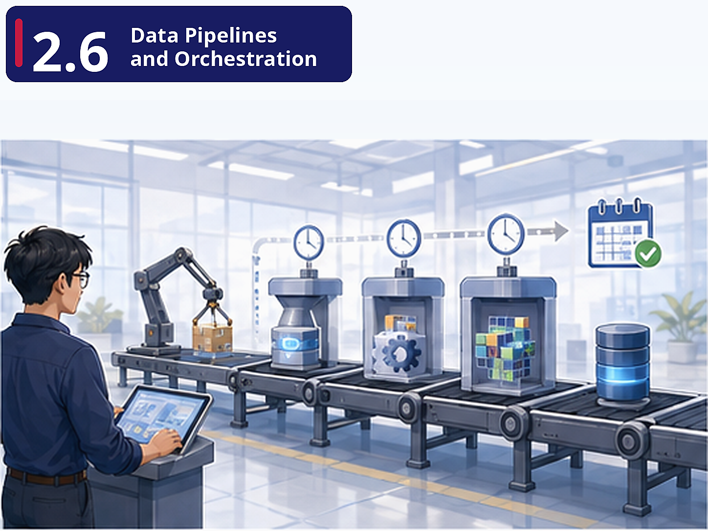

# Pre-class brief

## Where are we?

So far, you've been running everything manually — executing notebooks, running `dbt` commands in the terminal, calling APIs by hand. But FreshCart needs these pipelines to run *automatically*, every day, without anyone pressing a button. You also need to connect the **Extract** and **Load** steps to the **Transform** step into a single, automated end-to-end flow.

## Why this matters

A data pipeline that requires a human to run it is not a pipeline — it's a script. In production, data needs to flow from source to warehouse to dashboard on a schedule, with error handling, retries, and monitoring. Orchestration is what makes data engineering a *system* rather than a collection of ad-hoc scripts. This is also where the full ELT pattern comes together.

## Key concepts

**The ELT Pipeline Pattern (Meltano + dbt)** — Meltano uses the Singer specification (taps and targets) to extract data from any source and load it into any destination. dbt then transforms the loaded data inside the warehouse. This separation of concerns is the modern data stack philosophy.

**Data Orchestration (Dagster)** — Dagster's "software-defined assets" model makes you think about pipelines in terms of *what data they produce* rather than *what tasks they run*. A `pandas_releases` asset declares "this DataFrame exists and here's how to build it." A job materialises the assets. A schedule triggers the job.

**Configuration-Driven Pipelines** — Meltano's config files define pipeline behaviour declaratively. You don't write extraction code — you configure a tap. This makes pipelines reproducible, auditable, and easier to hand off. FreshCart can add a new data source by adding a config block, not rewriting a pipeline.

